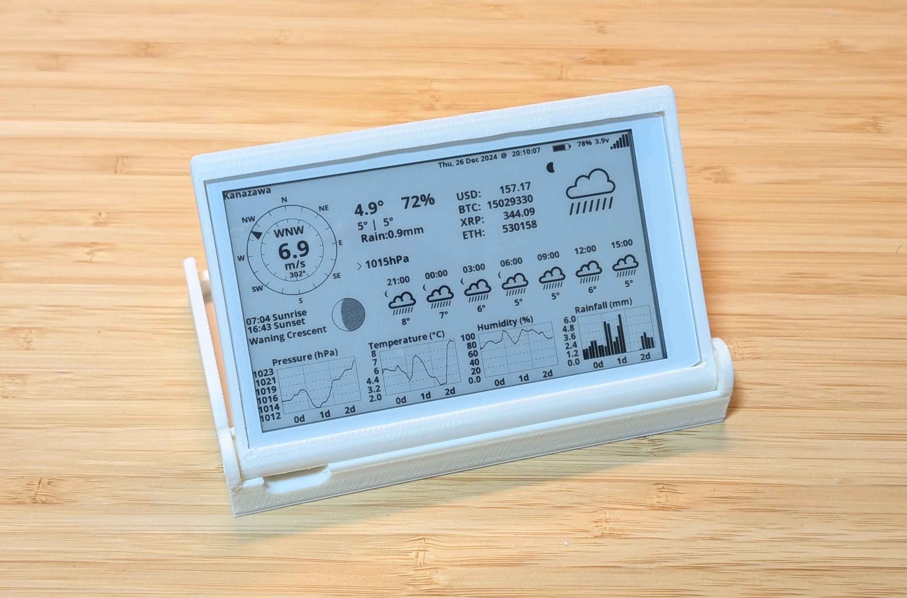
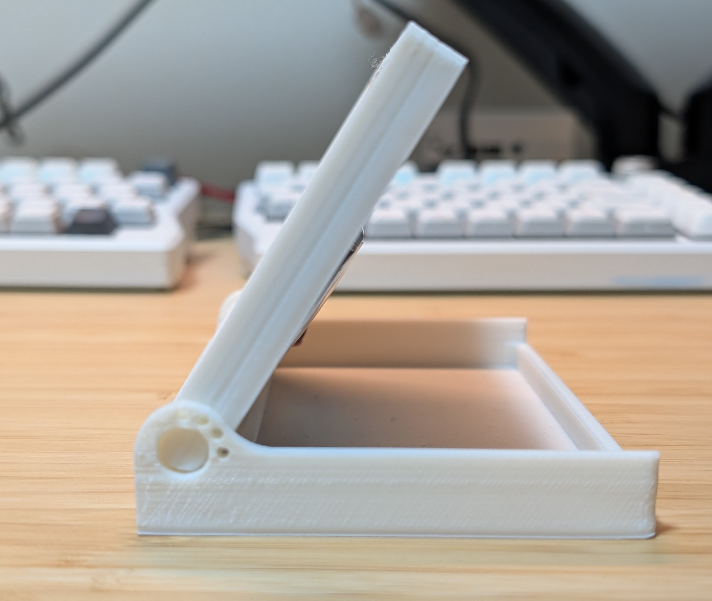

# このプロジェクトは
LilyGoの4.7インチ電子ペーパーを使って、天気情報と為替と仮想通貨の相場を表示するプロジェクトです。  
以下のプロジェクトをフォークしています。  
https://github.com/Xinyuan-LilyGO/LilyGo-EPD-4-7-OWM-Weather-Display

## 製作例

## 使い方
### Hardware
LiLyGoの4.7インチ電子ペーパーはAliexpress等で購入できます。  
リポバッテリーは別途購入してください。  

筐体は3ddataフォルダにSTL/STEPデータがあるので3Dプリンタで印刷してお使いいただけます。  
ただし、電子ペーパーの仕様変更等により、筐体のサイズが合わない場合があります。  
その場合は別途調整してください。  

### Software
`owm_credentials.h`がコンフィグファイルになっています。  
WiFi情報や、apikey、地域コード等は自分の好みに合わせて修正して下さい。  
このプロジェクトをクローンし、platformioを使ってビルドして書き込んでください。  
